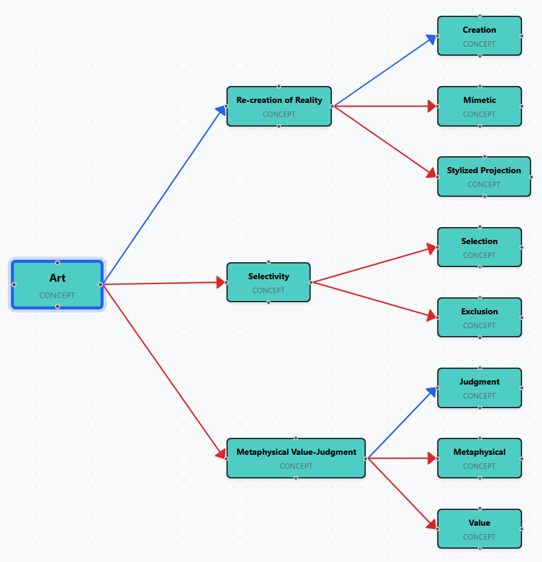
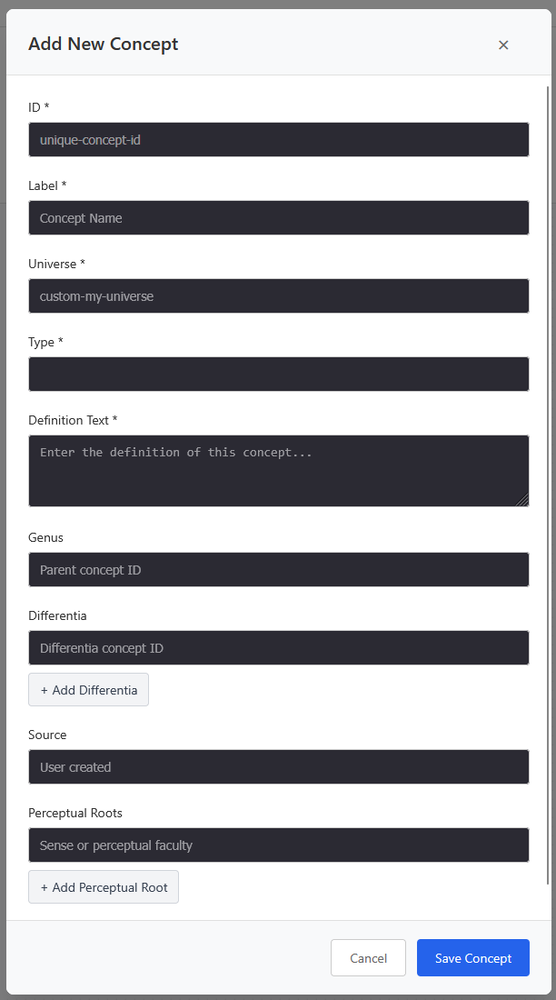

# Premises

_Check Your Premises_

## Overview

Premises is a concept visualization and study tool based on Aristotelian/Objectivist principles of concept formation and definition. It provides an interactive environment for exploring conceptual relationships, focusing on the hierarchical structure of knowledge through genus-differentia definitions.

## Live Application

**Experience the app in action: [https://lebbe.github.io/premises](https://lebbe.github.io/premises)**

_Example: Exploring the concept of "Art" and its relationships. Try it yourself at [https://lebbe.github.io/premises#concept=art](https://lebbe.github.io/premises#concept=art)_

## StudyView Features

The StudyView is the primary interface for focused conceptual study and exploration:

### Core Functionality

- **Concept Search & Selection**: Search across multiple conceptual universes with intelligent weighting that prioritizes Ayn Rand's definitions
- **Interactive Graph Visualization**: Dynamic network display of conceptual relationships with customizable layouts
- **Focused Study Mode**: Build graphs around specific concepts with configurable traversal depth (1-5 levels)
- **Relationship Filtering**: Toggle between genus edges (generalizations) and differentia edges (specializations)

### Navigation & State Management

- **URL-Based State**: All graph states are encoded in URLs, enabling bookmarking and browser navigation
- **Browser Integration**: Full support for back/forward buttons and right-click "Open in new tab"
- **Persistent Configuration**: Layout options, edge filters, and universe selections are preserved across sessions

### Conceptual Hierarchy

- **Genus-Differentia Structure**: Visualizes the logical structure of definitions following Aristotelian principles
- **Hierarchical Layout Algorithm**: Specialized layout that tends to place genus concepts above and differentia concepts below their references
- **Dynamic Edge Attachment**: Intelligent edge positioning based on conceptual relationships and node positions

### Interactive Features

- **Concept Info Panel**: Detailed view of selected concepts showing definitions, sources, and relationships
- **Focus Navigation**: Click through conceptual networks via genus/differentia links
- **Multi-Universe Support**: Explore concepts across different philosophical and scientific domains
- **Real-time Search**: Dropdown suggestions with focus-triggered display

### Study Workflow

1. **Search**: Find concepts using the intelligent search with universe-weighted results
2. **Focus**: Select a concept to build a focused graph around it
3. **Explore**: Navigate through genus and differentia relationships
4. **Configure**: Adjust traversal depth, layout direction, and relationship visibility
5. **Navigate**: Use browser history to move between different conceptual focuses

The tool embodies the Objectivist approach to concepts as "units of thought" that integrate similarities while omitting measurements, providing a visual framework for understanding the hierarchical structure of knowledge.

## Add Concept Dialog

The application now features a comprehensive Add Concept dialog that allows users to create and define their own concepts within the system.

### Features

- **Complete Definition Framework**: Create concepts with full Aristotelian structure including genus, differentia, and perceptual roots
- **Form Validation**: Ensures all required fields are completed before saving
- **Dynamic Input Lists**: Add/remove multiple differentia and perceptual roots with intuitive + and × buttons
- **Auto-focus**: Newly added input fields automatically receive focus for seamless data entry
- **Auto-complete**:
  - Genre field provides dropdown suggestions from existing concepts
  - Perceptual roots field offers common sense suggestions (vision, hearing, touch, smell, taste)
- **Universe Management**: Create concepts within custom universes (must start with "custom-")
- **Type Selection**: Choose between "concept" and "axiomatic concept" classifications

### Form Fields

- **ID**: Unique identifier for the concept
- **Label**: Display name for the concept
- **Universe**: Custom universe classification (e.g., "custom-philosophy", "custom-science")
- **Type**: Concept classification type
- **Definition Text**: The complete definition of the concept
- **Genus**: Parent concept or broader category
- **Differentia**: Distinguishing characteristics that separate this concept from others in its genus
- **Source**: Attribution or source reference
- **Perceptual Roots**: The sensory or perceptual foundations of the concept

The dialog integrates seamlessly with the existing concept visualization system, and newly created concepts immediately become available for study and exploration within the graph interface.

### Notes on defining Aristotelian concepts

There is always only one genus. Sometimes the genus might be a phrase, and not a word. Its a pure technical debate wether this is "correct" or not. If you think it is wrong, then just consider the phrase genus as a "helper" concept, and not a true concept (and look for the concepts that helper-concept is pointing to for a list of "genus" concepts).

Remember that a concept is not the same as a word!

The differentia should be a list of the concepts a person needs to grasp, in order to grasp the concept (together with grasping the genus, of course). It should _not_ only be all the words used in the definition, it should only summarize the differentia-part of the definition by listing all invovled concepts.

Please remember that a word is not the same as a concept (even though Wittgenstein seemed to disagree)!

## Edit Concept Functionality

The application now includes comprehensive edit functionality that allows users to modify existing concepts directly within the visualization interface.

### Edit Mode Toggle

- **Global Edit Mode**: Toggle edit mode on/off using the "Enable Edit Mode" checkbox in the header toolbar
- **Visual Indicator**: When edit mode is active, clicking on concept nodes opens the edit dialog instead of the info panel
- **Safe Editing**: Edit mode prevents accidental modifications while still allowing normal graph navigation when disabled

### Editing Concepts

When edit mode is enabled:

1. **Click any concept node** in the graph to open the edit dialog
2. **Modify any field** including definition text, genus, differentia, perceptual roots, etc.
3. **Save changes** to update the concept across the entire application
4. **Cancel editing** to discard changes and return to the graph

### Edit Dialog Features

- **Pre-populated Fields**: All existing concept data is automatically loaded into the form
- **ID Validation**: Prevents conflicts with other concepts while allowing the current concept to keep its ID
- **Real-time Updates**: Changes are immediately reflected in the graph and available for exploration
- **Comprehensive Editing**: Full access to all concept properties including dynamic lists of differentia and perceptual roots

### Integration with Visualization

- **Live Updates**: Edited concepts immediately update in the graph visualization
- **Relationship Preservation**: All conceptual relationships (genus, differentia) are maintained and updated
- **State Management**: Edited concepts are stored in application memory and included in any export functionality

The edit functionality provides a complete CRUD (Create, Read, Update) interface for concept management within the philosophical framework of the application.

## Important Disclaimers

### Work in Progress

**This is a work in progress.** The concept definitions, genus classifications, and differentia specifications contained in this application can and will contain errors. All errors and inaccuracies are the sole responsibility of the project owner, Lars-Erik Bruce.

### Content Sources & Generation

- **Ayn Rand Definitions**: Definitions attributed to Ayn Rand are taken directly from her published literature
- **LLM-Assisted Content**: Except for Ayn Rand's original definitions, an LLM (Large Language Model) has been used to generate genus classifications, differentia specifications, and definitions for undefined concepts, all under the guidance of the project owner
- **Human Review**: All generated content has been reviewed and approved by the project owner, but may still contain philosophical or logical errors

### Feedback & Corrections

We strongly encourage all users to help improve the accuracy of conceptual definitions:

- **GitHub Issues**: Please create issues in this repository to report errors or suggest improvements
- **Contact**: Reach out to Lars-Erik Bruce directly for corrections to concept definitions, genus classifications, or differentia specifications
- **Contributions**: Your expertise in philosophy, science, or specific conceptual domains is valuable for improving this tool

The goal is to create an accurate and philosophically sound representation of conceptual relationships. Your feedback is essential to achieving this objective.
